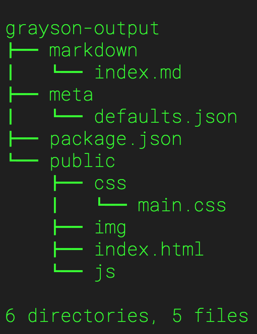

***Static Site Generator***

### Installation
```
npm install -g @earthtone/grayson-generator
```

### Usage

Scaffold project directory structure

```
grayson init [project-directory]

```



Generate HTML files from MD & JSON files

```
grayson gen <project-directory> [output-directory] [pages-directory] [meta-directory]

```

Traverses `/pages` directory and `/meta` directory for files. 

E.G. The files `/pages/index.md` & `/meta/index.json` yield an `index.html` file output in the `/public` directory.

Both the source directories and output directories are configurable, but default to an assumed structure generated during `grayson init`.